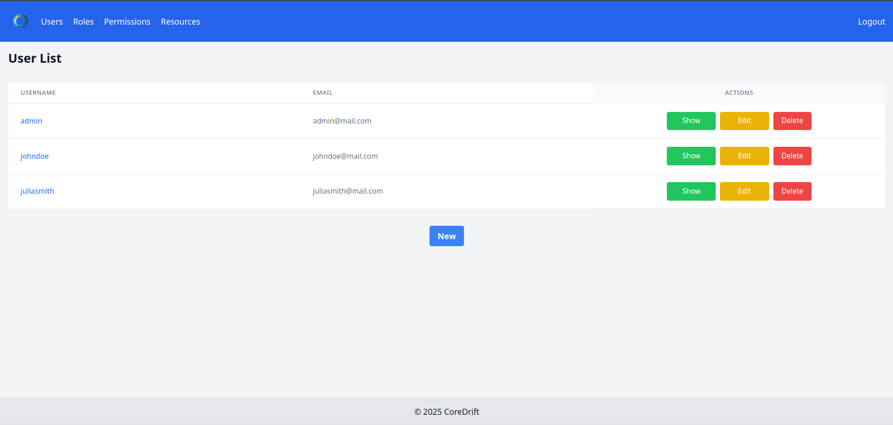
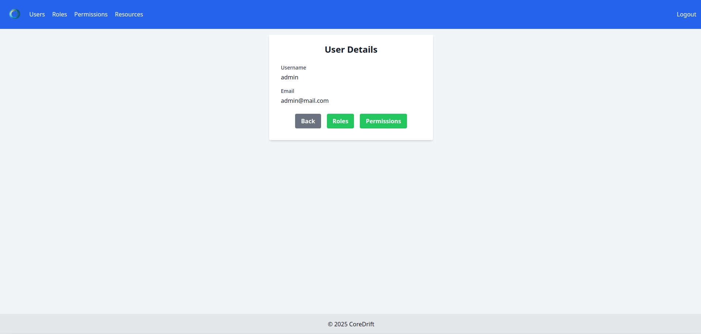
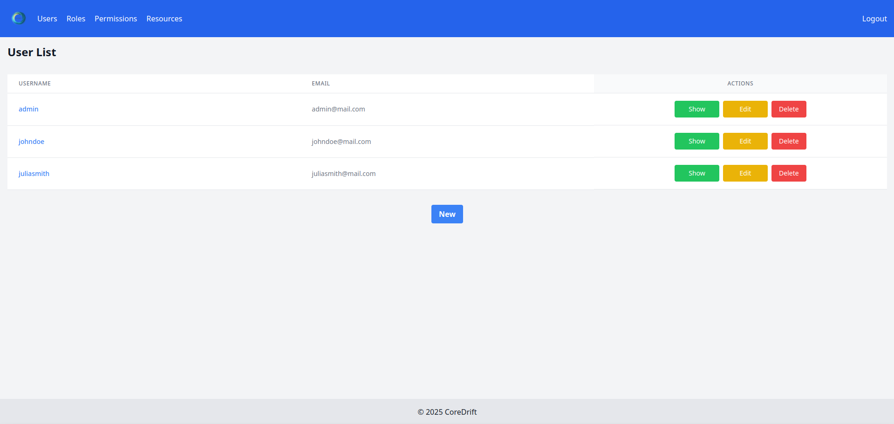
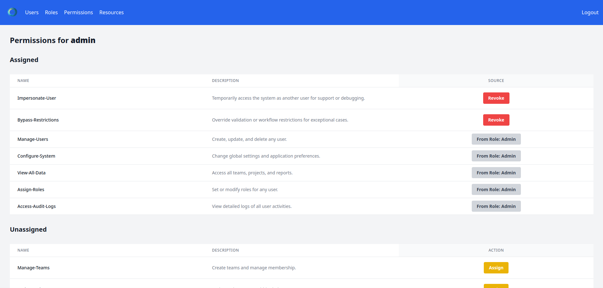

# CoreDrift

CoreDrift is the foundation of a work-in-progress project. For now, it includes an authentication and authorization system based on the following:

- **Users**: Represent individuals who interact with the system.
- **Roles**: Define a set of permissions that can be assigned to users.
- **Permissions**: Specify the actions that can be performed within the system.
- **Resources**: Represent the entities or areas that permissions apply to.

Users acquire permissions through their assigned roles and directly, enabling them to access specific resources. Eventually, this logic may be generalized for use in other projects.

## Screenshots

Here are some screenshots to give you an idea of how parts of the app look:

1. **List Users**
   

2. **Show User**
   

3. **List User Roles**
   

4. **List User Permissions**
   

## Notes

- [ ] Ensure the `superadmin` user password is changed after the first login to avoid vulnerabilities. (*) This will be enforced in future updates.
- [ ] Run `rails db:seed` to initialize the database with required data. (This step may not be necessary in the future, or seeding values will be adjusted appropriately for production.)
