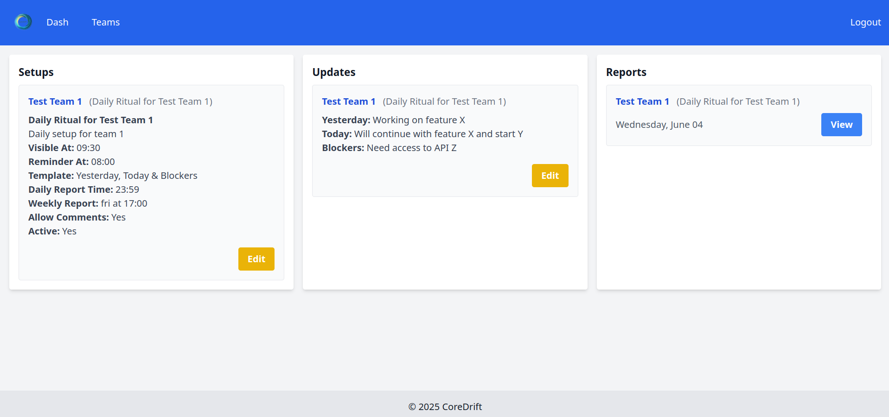

# CoreDrift

CoreDrift is an async daily stand-up facilitator for distributed teams. It lets everyone share updates on their own schedule, keeps history organized, and includes a simple permissions layer for access control.

## Screenshot

A sample screenshot of the app:



[See more screenshots in the gallery...](docs/gallery.md)

## Seeding for Initial Exploration

The seeding process is designed for the initial exploration phase of the application. It creates predefined users, roles, and permissions to help developers and testers understand the system's functionality.

The seeding process creates a set of archetypical users for each of the 3 test teams (Test Team 1, Test Team 2, Test Team 3). These users are assigned roles contextual to their respective teams. For **Test Team 1**, the credentials are as follows:

| Role              | Username                         | Email                            | Password                 |
|-------------------|----------------------------------|----------------------------------|--------------------------|
| Team Lead         | `team-lead-test-1`               | `team-lead-test-1@example.com`   | `team-lead-test-1`       |
| Software Engineer | `software-engineer-test-1`       | `software-engineer-test-1@example.com` | `software-engineer-test-1` |
| Designer          | `designer-test-1`                | `designer-test-1@example.com`    | `designer-test-1`        |
| Product Owner     | `product-owner-test-1`           | `product-owner-test-1@example.com` | `product-owner-test-1`   |
| QA Engineer       | `qa-engineer-test-1`             | `qa-engineer-test-1@example.com` | `qa-engineer-test-1`     |
| DevOps Engineer   | `devops-engineer-test-1`         | `devops-engineer-test-1@example.com` | `devops-engineer-test-1` |
| Scrum Master      | `scrum-master-test-1`            | `scrum-master-test-1@example.com`| `scrum-master-test-1`    |
| Business Analyst  | `business-analyst-test-1`        | `business-analyst-test-1@example.com`| `business-analyst-test-1`|

Similar sets of users are created for **Test Team 2** (e.g., username `team-lead-test-2`, email `team-lead-test-2@example.com`, password `team-lead-test-2`) and **Test Team 3** (e.g., username `team-lead-test-3`, email `team-lead-test-3@example.com`, password `team-lead-test-3`), following the same pattern for all contextual roles.

These credentials are useful for testing and manual verification purposes during development.

## Notes

- [ ] Ensure the `superadmin` user password is changed after the first login to avoid vulnerabilities. (*) This will be enforced in future updates.
- [ ] Run `rails db:seed` to initialize the database with required data. (This step may not be necessary in the future, or seeding values will be adjusted appropriately for production.)

To reset the database and reseed it for testing purposes, you can use the following rake task:

```bash
rake db:full_reset
